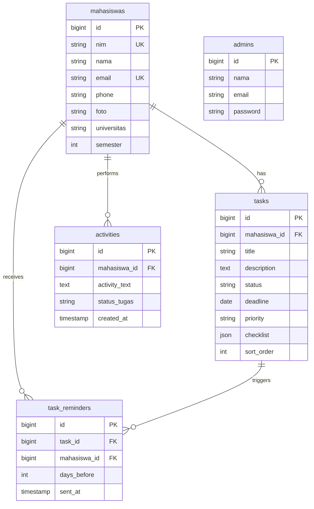

# DOKUMEN APLIKASI
# PROYEK 1

* **Nama Aplikasi**: TaskMate: Sistem Manajemen Tugas dan Produktivitas Berbasis Web
* **Nama Kelompok**: Kelompok 26
* **Anggota (Nama - NPM)**:
  1. Muhammad Ilham Habiballah - 714250003
  2. Gianjar Nugraha - 714250007
* **Program Studi**: D4 Teknik Informatika
* **Institusi**: Universitas Logistik dan Bisnis Internasional (ULBI)
* **Tahun Akademik**: 2025/2026

---

## KATA PENGANTAR

Puji syukur penulis panjatkan ke hadirat Allah SWT karena atas rahmat dan karunia-Nya, penulis dapat menyelesaikan laporan Proyek 1 yang berjudul "TaskMate: Sistem Manajemen Tugas dan Produktivitas Berbasis Web" tepat pada waktunya.

Laporan ini disusun sebagai salah satu syarat untuk menempuh sidang Proyek 1 pada Program Studi D4 Teknik Informatika, Universitas Logistik dan Bisnis Internasional (ULBI). Penulis menyadari bahwa selesainya laporan ini tidak lepas dari bantuan, bimbingan, dan dukungan dari berbagai pihak. Oleh karena itu, penulis ingin menyampaikan terima kasih kepada:

1. Bapak Cahyo Prianto, S.Pd., M.T., CDSP, SFPC, selaku Dosen Pembimbing Kelompok 26 yang telah memberikan banyak waktu, ilmu, arahan, serta kesabaran dalam membimbing penulis dari awal perencanaan proposal hingga penyelesaian implementasi sistem ini.
2. Bapak M. Yusril Helmi Setyawan, S.Kom., M.Kom., selaku Koordinator Mata Kuliah Proyek 1 yang telah memfasilitasi dan mengarahkan jalannya perkuliahan proyek dengan sangat terstruktur.
3. Seluruh Dosen dan Staf Pengajar Program Studi D4 Teknik Informatika Universitas Logistik dan Bisnis Internasional (ULBI) yang telah membekali penulis dengan fondasi ilmu pengetahuan yang bermanfaat.
4. Orang tua dan keluarga tercinta yang senantiasa memberikan doa, motivasi, serta dukungan moril maupun materil sepanjang penyusunan proyek ini.
5. Rekan seperjuangan satu tim kelompok, serta seluruh teman-teman mahasiswa D4 Teknik Informatika angkatan 2025/2026 yang saling mendukung dan bertukar pikiran demi kelancaran proyek ini.

Penulis menyadari bahwa laporan akhir ini masih jauh dari kata sempurna, baik dari segi penyusunan kalimat, tata bahasa, maupun fungsionalitas sistem yang dikembangkan. Oleh karena itu, penulis sangat mengharapkan kritik, saran, dan masukan yang membangun dari para pembaca demi perbaikan dan pengembangan aplikasi ini di masa mendatang.

Akhir kata, semoga laporan akhir proyek ini dapat memberikan manfaat yang nyata, menambah wawasan, serta menjadi kontribusi positif bagi rekan-rekan mahasiswa dan pembaca sekalian.

Bandung, Februari 2026

Penulis

---

## LEMBAR PERNYATAAN PERSETUJUAN DAN PERMOHONAN SIDANG PROYEK 1

Saya sebagai Pembimbing Kelompok 26 dengan Anggota:

| No | Nama Mahasiswa | NPM |
|---|---|---|
| 1 | Muhammad Ilham HabiBallah | 714250003 |
| 2 | Gianjar Nugraha | 714250007 |

* **Judul Proyek 1**: TaskMate: Sistem Manajemen Tugas dan Produktivitas Berbasis Web

Menyatakan bahwa mahasiswa tersebut telah menyelesaikan semua luaran dengan kemajuan: **100%**.  
Bagian yang belum diselesaikan (Jika ada): **- (Tidak ada)**

Adapun penulisan laporan Akhir Proyek 1 telah diselesaikan seluruhnya (100%). Dengan demikian saya mengajukan mahasiswa tersebut untuk mengikuti sidang Proyek 1. Apabila ternyata pernyataan saya tersebut tidak benar, maka saya menyetujui penundaan sidang termasuk pembatalan sidang Proyek 1 untuk mahasiswa bimbingan saya tersebut sesuai aturan yang berlaku.

Bandung, Februari 2026

**Mahasiswa 1**  
Muhammad Ilham Habiballah  
NPM: 714250003  

**Mahasiswa 2**  
Gianjar Nugraha  
NPM: 714250007  

**Dosen Pembimbing**  
Cahyo Prianto, S.Pd., M.T., CDSP, SFPC  
NIK: 117.84.222  

---

## LEMBAR PENGESAHAN

### TaskMate: Sistem Manajemen Tugas dan Produktivitas Berbasis Web

Oleh:  
* **Muhammad Ilham Habiballah** (NPM: 714250003)  
* **Gianjar Nugraha** (NPM: 714250007)  

Dokumen Proyek 1 ini telah diperiksa, disetujui, dan disidangkan di Bandung, pada:  
Tanggal: `____________________`

Oleh:

| Penguji Pendamping | Penguji Utama |
| :---: | :---: |
| `_______________________` <br> NIK: | `_______________________` <br> NIK: |

| Pembimbing | Koordinator Proyek 1 |
| :---: | :---: |
| **Cahyo Prianto, S.Pd., M.T., CDSP, SFPC** <br> NIK: 117.84.222 | **M. Yusril Helmi Setyawan, S.Kom., M.Kom** <br> NIK: 113.74.163 |

Menyetujui,  
**Ketua Program Studi D-IV Teknik Informatika ULBI**  

**Roni Andarsyah, S.T., M.Kom., CAPC., SFPC**  
NIK: 115.88.193

---

## DAFTAR ISI

* [KATA PENGANTAR](#kata-pengantar)
* [LEMBAR PERNYATAAN PERSETUJUAN](#lembar-pernyataan-persetujuan-dan-permohonan-sidang-proyek-1)
* [LEMBAR PENGESAHAN](#lembar-pengesahan)
* [DAFTAR GAMBAR](#daftar-gambar)
* [BAB I PENDAHULUAN](#bab-i-pendahuluan)
  * [1.1 Latar Belakang](#11-latar-belakang)
  * [1.2 Nama Aplikasi dan Dasar Ide](#12-nama-aplikasi-dan-dasar-ide)
    * [1.2.1 Visi Aplikasi](#121-visi-aplikasi)
    * [1.2.2 Misi Aplikasi](#122-misi-aplikasi)
  * [1.3 Tujuan Pengembangan](#13-tujuan-pengembangan)
    * [1.3.1 Tujuan Umum](#131-tujuan-umum)
    * [1.3.2 Tujuan Khusus](#132-tujuan-khusus)
  * [1.4 Ruang Lingkup](#14-ruang-lingkup)
* [BAB II DESKRIPSI SISTEM](#bab-ii-deskripsi-sistem)
  * [2.1 Gambaran Umum Aplikasi](#21-gambaran-umum-aplikasi)
  * [2.2 Stakeholder dan User](#22-stakeholder-dan-user)
    * [2.2.1 Administrator (Admin)](#221-administrator-admin)
    * [2.2.2 Mahasiswa (User Utama)](#222-mahasiswa-user-utama)
    * [2.2.3 Tamu (Guest / Pengunjung Publik)](#223-tamu-guest--pengunjung-publik)
  * [2.3 Kebutuhan Fungsional](#23-kebutuhan-fungsional)
    * [2.3.1 Kebutuhan Fungsional untuk Hak Akses: Admin](#231-kebutuhan-fungsional-untuk-hak-akses-admin)
    * [2.3.2 Kebutuhan Fungsional untuk Hak Akses: Mahasiswa](#232-kebutuhan-fungsional-untuk-hak-akses-mahasiswa)
    * [2.3.3 Kebutuhan Fungsional Sistem (Otomatisasi Pengingat & Log)](#233-kebutuhan-fungsional-sistem-otomatisasi-pengingat--log)
  * [2.4 Kebutuhan Non-Fungsional](#24-kebutuhan-non-fungsional)
    * [2.4.1 Keamanan Data dan Akses (Security - Hashing & Middleware)](#241-keamanan-data-dan-akses-security---hashing--middleware)
    * [2.4.2 Kinerja dan Kecepatan Sistem (Performance)](#242-kinerja-dan-kecepatan-sistem-performance)
    * [2.4.3 Manajemen Penyimpanan Berkas (Storage)](#243-manajemen-penyimpanan-berkas-storage---foto-profil--file)
    * [2.4.4 Kemudahan Penggunaan (Usability)](#244-kemudahan-penggunaan-usability)
    * [2.4.5 Navigasi yang Jelas](#245-navigasi-yang-jelas)
* [BAB III PERANCANGAN SISTEM](#bab-iii-perancangan-sistem)
  * [3.1 Arsitektur Sistem](#31-arsitektur-sistem)
  * [3.2 Workflow Sistem](#32-workflow-sistem)
    * [3.2.1 Autentikasi Pengguna (Login/Register)](#321-autentikasi-pengguna-loginregister)
    * [3.2.2 Pembuatan & Pengisian Formulir Tugas Baru](#322-pembuatan--pengisian-formulir-tugas-baru)
    * [3.2.3 Pengecekan & Pengaturan Pengingat Otomatis](#323-pengecekan--pengaturan-pengingat-otomatis-task-reminder)
    * [3.2.4 Pembaruan Status Tugas (Kanban Board)](#324-pembaruan-status-tugas-kanban-board)
    * [3.2.5 Rekapitulasi Progres Tugas Mahasiswa di Dashboard](#325-rekapitulasi-progres-tugas-mahasiswa-di-dashboard)
  * [3.3 Class Diagram](#33-class-diagram)
  * [3.4 Entity Relationship Diagram (ERD)](#34-entity-relationship-diagram-erd)
    * [3.4.1 Struktur Tabel](#341-struktur-tabel)
    * [3.4.2 Relasi Antar Tabel](#342-relasi-antar-tabel)
* [BAB IV DESAIN ANTARMUKA](#bab-iv-desain-antarmuka)
  * [4.1 Konsep Desain (Clean & Responsive)](#41-konsep-desain-clean--responsive)
  * [4.2 Mockup/Wireframe](#42-mockupwireframe)
    * [4.2.1 Tampilan Landing Page / Pengunjung Publik](#421-tampilan-landing-page--pengunjung-publik)
    * [4.2.2 Tampilan Panel Kontrol Administrator](#422-tampilan-panel-kontrol-administrator-admin-dashboard)
    * [4.2.3 Tampilan Dashboard & Kanban Board Mahasiswa](#423-tampilan-dashboard--kanban-board-mahasiswa)
    * [4.2.4 Tampilan Halaman Pengaturan Profil & Bantuan](#424-tampilan-halaman-pengaturan-profil--bantuan)
  * [4.3 Deskripsi Tampilan](#43-deskripsi-tampilan)
* [BAB V IMPLEMENTASI DASAR](#bab-v-implementasi-dasar)
  * [5.1 Tools dan Teknologi](#51-tools-dan-teknologi)
  * [5.2 Struktur Folder Proyek](#52-struktur-folder-proyek)
  * [5.3 Petunjuk Menjalankan Aplikasi](#53-petunjuk-menjalankan-aplikasi)
* [BAB VI PENUTUP](#bab-vi-penutup)
  * [6.1 Kesimpulan](#61-kesimpulan)
  * [6.2 Saran Pengembangan](#62-saran-pengembangan)
* [DAFTAR PUSTAKA](#daftar-pustaka)

---

## DAFTAR GAMBAR

* Gambar 3.1 Diagram Arsitektur TaskMate
* Gambar 3.2 Workflow Sistem TaskMate
* Gambar 3.3 Class Diagram TaskMate
* Gambar 3.4 ERD Database TaskMate
* Gambar 4.1 Mockup Landing Page
* Gambar 4.2 Mockup Admin Dashboard
* Gambar 4.3 Mockup Kelola Mahasiswa Admin
* Gambar 4.4 Mockup Dashboard Mahasiswa
* Gambar 4.5 Mockup Kanban Board
* Gambar 4.6 Mockup Profil Mahasiswa
* Gambar 4.7 Mockup Halaman Bantuan
* Gambar 5.1 Screenshot Landing Page
* Gambar 5.2 Screenshot Login Browser
* Gambar 5.3 Screenshot Admin Dashboard
* Gambar 5.4 Screenshot Admin Monitoring
* Gambar 5.5 Screenshot Student Dashboard
* Gambar 5.6 Screenshot Kanban Board Browser

---

## BAB I
## PENDAHULUAN

### 1.1 Latar Belakang

Pendidikan tinggi menuntut mahasiswa untuk bersikap mandiri, disiplin, dan mampu mengelola waktu dengan baik. Di lingkungan Universitas Logistik dan Bisnis Internasional (ULBI), mahasiswa dihadapkan pada kurikulum yang padat, proyek kelompok, praktikum, serta berbagai tugas akademik lainnya. Banyaknya beban tugas dengan tenggat waktu (deadline) yang beragam seringkali memicu kendala bagi mahasiswa dalam menentukan prioritas. Masalah klasik seperti penundaan pekerjaan (prokrastinasi), kelupaan terhadap tenggat waktu, hingga menumpuknya tugas di akhir semester menjadi hambatan utama dalam menjaga performa akademik yang optimal.

Metode pencatatan tugas konvensional, seperti menggunakan buku catatan fisik atau aplikasi catatan bawaan gawai yang tidak terintegrasi, dirasa kurang efektif. Sistem tersebut tidak memiliki mekanisme pengingat yang proaktif dan tidak dapat memvisualisasikan progres penyelesaian tugas secara sistematis. Akibatnya, mahasiswa kesulitan melacak tugas mana yang baru masuk (To Do), sedang dikerjakan (In Progress), maupun yang telah diselesaikan (Done).

Di sisi lain, institusi atau administrator akademik juga membutuhkan data atau pengawasan terkait tingkat produktivitas dan keaktifan mahasiswa dalam menyelesaikan kewajibannya. Monitoring yang minim dari pihak pengelola akademik membuat deteksi dini terhadap mahasiswa yang mengalami penurunan kinerja akademik menjadi sulit dilakukan.

Perkembangan teknologi web modern dengan framework seperti Laravel dan Tailwind CSS memberikan peluang besar untuk membangun platform manajemen tugas yang dinamis, responsif, dan terpusat. Keunggulan Laravel dalam hal keamanan autentikasi, manajemen database melalui Eloquent ORM, serta kemampuan eksekusi perintah terjadwal (task scheduling) sangat cocok untuk mendukung kebutuhan sistem ini. Selain itu, mengingat WhatsApp merupakan media komunikasi utama yang paling sering dibuka oleh mahasiswa dibandingkan surat elektronik (e-mail), integrasi pengingat berbasis WhatsApp Gateway menjadi solusi cerdas dan proaktif untuk meminimalkan keterlambatan pengumpulan tugas.

Berdasarkan permasalahan tersebut, dikembangkanlah sebuah aplikasi berbasis web bernama TaskMate. Aplikasi ini diharapkan mampu menjadi asisten digital bagi mahasiswa untuk mengelola tugas-tugas akademik mereka secara terstruktur menggunakan metode Kanban Board, sekaligus mempermudah administrator dalam melakukan monitoring melalui visualisasi statistik progres dan pencatatan log aktivitas sistem yang transparan.

### 1.2 Nama Aplikasi dan Dasar Ide

Aplikasi ini diberi nama **TaskMate**, yang diambil dari gabungan kata "Task" (tugas) dan "Mate" (teman/mitra). Nama ini merepresentasikan visi aplikasi sebagai "teman belajar" atau asisten digital setia yang mendampingi mahasiswa selama menempuh masa studi di perguruan tinggi.

Dasar ide pengembangan TaskMate lahir dari konsep manajemen kerja visual (visual management) menggunakan metode Kanban. Papan Kanban yang membagi alur kerja menjadi kolom terstruktur diadopsi ke dalam sistem digital untuk memberikan kemudahan bagi mahasiswa dalam memantau siklus hidup tugas mereka. Ditambah dengan integrasi layanan WhatsApp API sebagai pengirim pesan pengingat (deadline reminders), ide dasar TaskMate adalah menciptakan ekosistem manajemen tugas yang interaktif, proaktif, dan bebas dari kelalaian.

#### 1.2.1 Visi Aplikasi
"Menjadi platform manajemen tugas mahasiswa berbasis web nomor satu yang mendorong produktivitas, kemandirian, dan kedisiplinan akademik mahasiswa di lingkungan Universitas Logistik dan Bisnis Internasional (ULBI)."

#### 1.2.2 Misi Aplikasi
Untuk mewujudkan visi tersebut, misi dari pengembangan aplikasi TaskMate adalah sebagai berikut:
1. Menyediakan antarmuka manajemen tugas visual (Kanban Board) yang bersih, modern, mudah digunakan, dan responsif menggunakan Tailwind CSS.
2. Meminimalisasi keterlambatan pengumpulan tugas melalui sistem otomatisasi pengingat tenggat waktu (deadline) yang dikirimkan langsung ke nomor WhatsApp mahasiswa.
3. Menyediakan panel kontrol bagi administrator untuk memantau data mahasiswa, perkembangan tugas, serta log aktivitas sistem secara waktu nyata (real-time).
4. Menerapkan manajemen database MySQL yang aman dan efisien guna menjamin integritas data tugas dan profil pengguna.

### 1.3 Tujuan Pengembangan

Pengembangan aplikasi TaskMate memiliki beberapa tujuan penting yang terbagi menjadi tujuan umum dan tujuan khusus:

#### 1.3.1 Tujuan Umum
Membangun dan mengimplementasikan aplikasi manajemen tugas berbasis web (TaskMate) menggunakan framework Laravel, Tailwind CSS, dan database MySQL untuk meningkatkan efisiensi waktu, manajemen prioritas, serta produktivitas akademik mahasiswa ULBI.

#### 1.3.2 Tujuan Khusus
1. Merancang dan mengimplementasikan otorisasi hak akses (multi-role) yang membedakan ruang kerja antara Administrator dan Mahasiswa secara aman.
2. Menyediakan fitur pencatatan tugas (CRUD Tasks) yang dilengkapi dengan pengaturan prioritas dan tenggat waktu (due date).
3. Mengembangkan modul visualisasi tugas berbentuk Kanban Board (To Do, In Progress, Done) guna memudahkan pelacakan tugas oleh mahasiswa.
4. Mengintegrasikan scheduler Laravel dengan WhatsApp Service untuk mengirim notifikasi pengingat otomatis sebelum batas akhir tugas habis.
5. Membangun dasbor monitoring untuk admin yang menampilkan statistik visual jumlah mahasiswa, total tugas, tugas selesai, serta rekaman aktivitas (activity log).

### 1.4 Ruang Lingkup

Agar pengembangan sistem berjalan terfokus dan tidak meluas dari rencana awal, ruang lingkup proyek dibatasi sebagai berikut:
1. **Pengguna Sistem (Aktor)**: Sistem ini melibatkan dua aktor utama, yaitu Mahasiswa (sebagai pengguna akhir yang mengelola tugas pribadi, profil, dan mendapatkan pengingat) dan Administrator/Admin (sebagai pengelola data mahasiswa, pemantau papan tugas mahasiswa, dan pengawas log aktivitas).
2. **Platform dan Desain**: Aplikasi dibangun dalam platform web berbasis responsive design menggunakan framework Tailwind CSS sehingga nyaman diakses melalui komputer maupun perangkat seluler (mobile-friendly).
3. **Teknologi Backend & Frontend**: Menggunakan PHP 8.x dengan framework Laravel 10/11, JavaScript vanilla untuk interaksi dinamis, template engine Blade, dan MySQL sebagai sistem manajemen basis data.
4. **Fitur Pengingat (Reminder)**: Pengingat dikirim melalui integrasi WhatsApp Gateway API dengan memanfaatkan perintah konsol terjadwal (scheduled command) di Laravel yang mengecek tenggat waktu tugas secara harian.
5. **Keamanan & Validasi**: Keamanan data mahasiswa menggunakan enkripsi hashing pada kata sandi, validasi format nomor WhatsApp Indonesia (format 62), serta otentikasi hak akses terisolasi bagi masing-masing mahasiswa agar tidak dapat saling melihat tugas mahasiswa lain.

---

## BAB II
## DESKRIPSI SISTEM

### 2.1 Gambaran Umum Aplikasi

Aplikasi TaskMate adalah platform manajemen tugas berbasis web yang dirancang khusus untuk memfasilitasi mahasiswa dalam merencanakan, memantau, dan menyelesaikan tugas-tugas akademis secara teratur. Dengan mengusung konsep minimalis, modern, dan fungsional, TaskMate mengintegrasikan beberapa fitur utama, seperti visualisasi kemajuan tugas menggunakan papan kerja (Kanban Board), pencatatan jejak audit aktivitas (Activity Logging), serta pengingat otomatis tanggal jatuh tempo (due date) tugas melalui aplikasi WhatsApp.

Aplikasi ini menggunakan arsitektur Client-Server dengan didukung oleh framework Laravel pada sisi backend untuk memproses logika bisnis dan keamanan data. Pada sisi frontend, kerangka kerja Tailwind CSS diaplikasikan untuk menghasilkan antarmuka pengguna yang bersih, responsif (responsive design), dan memiliki nilai estetika modern. Basis data relational MySQL digunakan untuk menyimpan dan mengorganisasi seluruh entitas data secara terstruktur, mulai dari data profil pengguna, detail tugas, log audit, hingga jadwal pengingat tugas. Secara umum, TaskMate bertindak sebagai jembatan produktivitas yang mempertemukan kemandirian mahasiswa dalam mengelola beban tugas mereka dengan transparansi pengawasan oleh administrator. Dengan adanya platform ini, proses pelacakan tugas tidak lagi bersifat pasif, melainkan menjadi proaktif berkat adanya scheduler system yang mengotomatisasi pengiriman notifikasi pengingat secara tepat waktu.

### 2.2 Stakeholder dan User

Dalam pengoperasian dan pemanfaatan sistem TaskMate, terdapat tiga kategori pengguna utama (user) yang memiliki peran, hak akses, dan interaksi yang berbeda terhadap aplikasi. Pengguna tersebut dijabarkan sebagai berikut:

#### 2.2.1 Administrator (Admin)
Administrator adalah pengguna yang memiliki wewenang penuh dalam mengelola dan mengawasi jalannya sistem TaskMate. Admin bertindak sebagai operator penjamin ketertiban sistem yang memiliki tugas-tugas sebagai berikut:
1. Memantau statistik performa sistem secara menyeluruh melalui dasbor admin.
2. Mengelola akun-akun mahasiswa (menambah, mengubah informasi, atau menghapus akun mahasiswa jika diperlukan).
3. Melakukan monitoring terhadap papan tugas (Task Board) milik mahasiswa tertentu untuk melihat sejauh mana tugas kuliah diselesaikan.
4. Memiliki wewenang untuk menambahkan tugas baru secara langsung ke akun mahasiswa (sebagai bentuk instruksi atau penugasan khusus).
5. Memantau daftar riwayat log aktivitas (system audit log) untuk mendeteksi tindakan yang dilakukan oleh pengguna di dalam sistem.

#### 2.2.2 Mahasiswa (User Utama)
Mahasiswa merupakan pengguna utama (end-user) dari aplikasi TaskMate. Setiap mahasiswa memiliki ruang kerja (workspace) terisolasi yang tidak dapat diakses atau diubah oleh mahasiswa lainnya. Peran dan aktivitas mahasiswa di dalam sistem mencakup:
1. Melakukan pendaftaran akun (self-registration) dan masuk ke sistem menggunakan kredensial berupa email/NIM dan kata sandi yang valid.
2. Mengelola data profil pribadi, seperti mengubah nama, memperbarui nomor WhatsApp yang aktif, menuliskan asal universitas, serta mengunggah foto profil.
3. Melakukan pengelolaan data tugas (CRUD Tasks) yang meliputi pengisian judul, deskripsi tugas, penentuan tenggat waktu (due date), serta pembaruan status tugas.
4. Mengubah status penyelesaian tugas secara interaktif (memindahkan tugas antar kolom status: To Do, In Progress, atau Done).
5. Mengakses halaman bantuan yang menyediakan tautan langsung (direct link) ke nomor WhatsApp admin apabila menemui kendala teknis.

#### 2.2.3 Tamu (Guest / Pengunjung Publik)
Tamu adalah pengunjung umum yang mengakses aplikasi TaskMate tanpa melakukan autentikasi (masuk akun). Akses tamu sangat dibatasi dan hanya bertujuan untuk memberikan informasi umum mengenai kredibilitas aplikasi. Fitur untuk Tamu mencakup:
1. Mengakses halaman utama (Landing Page).
2. Melihat kartu informasi statistik global secara real-time, seperti total mahasiswa terdaftar, total tugas terinput, dan total tugas yang telah berhasil diselesaikan di dalam sistem TaskMate.

### 2.3 Kebutuhan Fungsional

Kebutuhan fungsional (Functional Requirements) menjelaskan apa saja perilaku, fitur, serta proses bisnis yang harus mampu dijalankan oleh sistem TaskMate berdasarkan pembagian hak akses pengguna.

#### 2.3.1 Kebutuhan Fungsional untuk Hak Akses: Admin
1. **Sistem Autentikasi Admin**: Sistem harus menyediakan mekanisme masuk log khusus administrator (Admin Guard) terpisah dari guard mahasiswa.
2. **Dasbor Statistik Admin**: Sistem harus menampilkan data akumulatif secara waktu nyata, meliputi jumlah total mahasiswa terdaftar, jumlah seluruh tugas, dan jumlah tugas berstatus done.
3. **Manajemen Akun Mahasiswa (CRUD)**: Admin harus dapat menambah mahasiswa baru, melihat profil lengkap mahasiswa, mengedit data mahasiswa (termasuk universitas dan nomor telepon), serta menghapus akun mahasiswa dari sistem.
4. **Monitoring Task Board Mahasiswa**: Admin harus dapat membuka dan melihat visualisasi Kanban Board dari setiap mahasiswa secara spesifik untuk memantau tugas mereka.
5. **Manajemen Tugas Mahasiswa oleh Admin**: Admin harus dapat membuatkan tugas baru, mengubah tugas, atau menghapus tugas pada akun mahasiswa yang dipantaunya.
6. **Pemantauan Log Aktivitas**: Sistem harus menampilkan riwayat aksi sistem (seperti aksi tambah tugas, ubah status, login, dan aksi admin) lengkap dengan nama pelaku aksi, tipe aktivitas, deskripsi, dan waktu kejadian (timestamp).

#### 2.3.2 Kebutuhan Fungsional untuk Hak Akses: Mahasiswa
1. **Registrasi Akun**: Sistem harus menyediakan form registrasi bagi mahasiswa baru untuk mengisi nama, NIM, email, universitas, nomor telepon, dan kata sandi.
2. **Autentikasi Mahasiswa**: Mahasiswa harus dapat masuk menggunakan kredensial email dan kata sandi yang telah terdaftar, serta dapat keluar (logout) dari sistem secara aman.
3. **Manajemen Profil**: Mahasiswa harus dapat mengunggah file foto profil (format JPG/PNG), memperbarui nama, menuliskan nama universitas, dan memperbarui nomor telepon yang akan digunakan untuk pengingat WhatsApp.
4. **Manajemen Tugas (CRUD)**: Mahasiswa harus dapat membuat tugas baru (mengisi judul, deskripsi, status awal, dan batas waktu), melihat detail tugas, menyunting isi tugas, serta menghapusnya.
5. **Interaktivitas Kanban Board**: Mahasiswa harus dapat memperbarui status tugas (memindahkan status dari kolom To Do ke In Progress atau Done).
6. **Halaman Bantuan**: Sistem harus menyediakan halaman informasi kontak admin dengan tombol tautan otomatis menuju WhatsApp API (`https://wa.me/number`).

#### 2.3.3 Kebutuhan Fungsional Sistem (Otomatisasi Pengingat & Log)
1. **Otomatisasi Pengingat Batas Waktu (Deadline Reminders)**: Sistem harus dapat berjalan di latar belakang (background job) menggunakan Task Scheduler Laravel untuk memindai tugas-tugas mahasiswa yang mendekati batas waktu penyelesaian.
2. **Pengiriman Pesan WhatsApp**: Sistem harus terhubung dengan API WhatsApp Gateway untuk mengirim pesan notifikasi secara otomatis ke nomor mahasiswa berisi nama tugas dan waktu tersisa sebelum jatuh tempo.
3. **Pencatatan Log Aktivitas Otomatis (Auto-Logging)**: Sistem secara otomatis harus merekam setiap transaksi data yang krusial (seperti saat tugas dibuat, diubah, atau statusnya diganti) ke dalam tabel database `activities`.

### 2.4 Kebutuhan Non-Fungsional

Kebutuhan non-fungsional (Non-Functional Requirements) menetapkan batasan properti operasional, kualitas teknis, dan performa dari sistem TaskMate agar dapat berjalan secara optimal dan aman.

#### 2.4.1 Keamanan Data dan Akses (Security - Hashing & Middleware)
1. **Enkripsi Kata Sandi**: Sistem wajib menyamarkan seluruh kata sandi pengguna (Mahasiswa dan Admin) sebelum disimpan ke dalam database MySQL menggunakan algoritma pengacak aman Bcrypt (Laravel Hashing).
2. **Proteksi Sesi dengan Middleware**: Akses halaman dashboard mahasiswa harus diproteksi dengan middleware `auth:web` dan halaman administrator diproteksi dengan middleware `auth:admin` serta filter middleware `admin`. Pengguna yang belum masuk tidak diperbolehkan mengakses tautan URL internal secara langsung.
3. **Proteksi Cross-Site Request Forgery (CSRF)**: Sistem harus menyertakan token CSRF pada setiap formulir input data untuk mencegah serangan siber manipulasi permintaan pihak ketiga.

#### 2.4.2 Kinerja dan Kecepatan Sistem (Performance)
1. **Kecepatan Memuat Halaman**: Penggunaan Tailwind CSS yang telah dikompilasi melalui bundler Vite harus mampu meminimalkan ukuran berkas aset sehingga halaman beranda dapat dimuat dalam waktu kurang dari 2 detik pada koneksi internet standar.
2. **Kueri Database yang Efisien**: Pengambilan data tugas pada dasbor harus dioptimalkan menggunakan kueri terindeks (seperti pencarian berdasarkan `mahasiswa_id`) untuk menjaga waktu respons database di bawah 200 milidetik.

#### 2.4.3 Manajemen Penyimpanan Berkas (Storage - Foto Profil & File)
1. **Validasi Ukuran dan Ekstensi Berkas**: Sistem harus membatasi ukuran berkas foto profil yang diunggah mahasiswa maksimal sebesar 2 Megabyte (MB) dengan ekstensi gambar yang diperbolehkan hanya JPG, JPEG, dan PNG.
2. **Penyimpanan Lokal Terstruktur**: File foto profil yang diunggah harus disimpan secara terorganisasi di dalam direktori penyimpanan Laravel (`storage/app/public/profile-photos`) dan diakses di sisi publik menggunakan tautan simbolis (symbolic link).

#### 2.4.4 Kemudahan Penggunaan (Usability)
1. **Desain Antarmuka yang Intuitif**: Antarmuka harus menggunakan elemen visual yang jelas, seperti penggunaan kartu warna (cards) yang menandakan tingkat prioritas tugas dan warna khusus untuk tugas yang sudah selesai (Done).
2. **Responsivitas Antarmuka**: Tata letak halaman web harus otomatis menyesuaikan resolusi layar gawai (desktop, tablet, dan smartphone) tanpa merusak struktur visual informasi.

#### 2.4.5 Navigasi yang Jelas
1. **Bilah Navigasi Samping (Sidebar)**: Menyediakan navigasi sidebar yang konsisten di sisi kiri layar untuk memudahkan perpindahan antar menu (Dasbor, Kelola Tugas, Profil, Bantuan).
2. **Umpan Balik Visual Dinamis**: Tombol tindakan harus memiliki efek hover (perubahan warna saat didekati kursor) dan menampilkan kotak dialog konfirmasi (modal pop-up) sebelum melakukan tindakan penting seperti menghapus tugas atau keluar akun (logout).

---

## BAB III
## PERANCANGAN SISTEM

### 3.1 Arsitektur Sistem

Arsitektur sistem TaskMate menggunakan model arsitektur Client-Server terdistribusi yang memisahkan antara bagian presentasi (antarmuka pengguna), pemrosesan logika bisnis (application server), dan penyimpanan data (database server), serta terintegrasi dengan layanan pihak ketiga (third-party API) untuk pengiriman notifikasi WhatsApp.

```
       +-------------------------------------------------------+
       |                  Client / Browser                     |
       |  (HTML5, Tailwind CSS, JavaScript Vanilla, SortableJS)|
       +---------------------------+---------------------------+
                                   |
                       AJAX (Fetch API) / HTTP
                                   v
       +-------------------------------------------------------+
       |               Laravel Application Server              |
       |              (Routing, Controllers, ORM)              |
       +-------+-------------------+-------------------+-------+
               |                   |                   |
           Eloquent ORM       Cron Job           HTTP Request
               v                   v                   v
       +---------------+   +---------------+   +-----------------------+
       | Database      |   | Task Scheduler|   | WhatsApp API Gateway  |
       | Server        |   | (Artisan      |   | (Fonnte API Service)  |
       | (MySQL/Maria) |   |  Command)     |   |                       |
       +---------------+   +---------------+   +-----------+-----------+
                                                           |
                                                      Notification
                                                           v
                                                       WhatsApp
                                                        Device
```
*Gambar 3.1 Diagram Arsitektur TaskMate*

#### Penjelasan Diagram Arsitektur:
1. **Client / Browser (Frontend)**: Sisi klien berinteraksi dengan pengguna (Mahasiswa/Admin) melalui browser web. Semua inputan dipetakan secara dinamis menggunakan HTML, CSS (Vanilla CSS & Tailwind), dan JavaScript. Permintaan data atau manipulasi kartu tugas dikirimkan secara asinkron (asynchronous) menggunakan AJAX Fetch API agar sistem responsif tanpa perlu memuat ulang halaman (zero-page reload).
2. **Laravel Application Server (Backend)**: Laravel bertindak sebagai pusat pengendali logika aplikasi. Permintaan dari browser masuk melalui Laravel Router dan diproses oleh Controller yang bersangkutan (misalnya `TaskController` atau `AdminDashboardController`). Controller berkomunikasi dengan Database Server menggunakan model Eloquent ORM.
3. **Database Server (MySQL)**: Basis data relasional MySQL bertindak sebagai tempat penyimpanan data permanen. Server database mengelola data kredensial, tugas, pengingat, dan log aktivitas.
4. **Task Scheduler & WhatsApp API Gateway (Fonnte)**: Untuk fitur otomatis, server Laravel menjalankan Cron Job di latar belakang (`php artisan tasks:send-deadline-reminders`). Script penjadwal mendeteksi tugas mendekati deadline (H-5 atau H-2), mengemas pesan teks pengingat, dan mengirimkan HTTP request ke API Gateway Fonnte. Server Fonnte kemudian meneruskan pesan tersebut ke nomor WhatsApp mahasiswa penerima secara otomatis.

### 3.2 Workflow Sistem

Workflow sistem dirancang untuk memberikan pemahaman mengenai siklus hidup data tugas dan bagaimana pengguna berinteraksi dengan fitur-fitur yang disediakan oleh aplikasi TaskMate.

```
      +-------------+        +-------------+        +-------------+
      |  Registrasi | -----> |  Login      | -----> |  Dashboard  |
      |  Mahasiswa  |        |  Credential |        |  Workspace  |
      +-------------+        +-------------+        +-------------+
                                                           |
                                                           v
      +-------------+        +-------------+        +-------------+
      | WhatsApp    | <----- |  Laravel    | <----- | Kanban Board|
      | Gateway API |        |  Scheduler  |        |  (CRUD Task)|
      +-------------+        +-------------+        +-------------+
```
*Gambar 3.2 Workflow Sistem TaskMate*

#### 3.2.1 Autentikasi Pengguna (Login/Register)
Proses autentikasi menjamin keamanan hak akses data bagi setiap mahasiswa.
* **Registrasi**: Mahasiswa baru mendaftarkan diri dengan mengisi data lengkap termasuk NIM, nomor WhatsApp aktif (untuk pengingat), pilihan semester (1–8), dan foto profil. Sistem memvalidasi data untuk memastikan NIM dan email belum terdaftar sebelumnya di database. Kata sandi kemudian dienkripsi menggunakan metode hashing bcrypt sebelum disimpan ke database.
* **Login**: Mahasiswa memasukkan email dan kata sandi. Sistem membandingkan kredensial dengan record database. Jika berhasil, session pengguna dibuat dan diarahkan ke Dashboard. Jika gagal, pengguna dikembalikan ke halaman login dengan pesan kesalahan.

#### 3.2.2 Pembuatan & Pengisian Formulir Tugas Baru
Pembuatan tugas dilakukan langsung pada papan Kanban menggunakan inline formulir input:
* Pengguna mengklik tombol "+ Tambah Task" di bagian bawah kolom.
* Pengguna mengisi formulir yang memuat nama tugas (judul), deskripsi detail, prioritas (Tinggi, Sedang, Rendah), dan tanggal tenggat waktu (deadline), serta item-item checklist tugas.
* Setelah menekan tombol Tambah, data dikirimkan lewat AJAX POST. Setelah divalidasi oleh backend, data tugas disimpan dengan status default 'todo' (masuk kolom To Do pertama kali) dan visual papan Kanban diperbarui secara real-time.

#### 3.2.3 Pengecekan & Pengaturan Pengingat Otomatis (Task Reminder)
Pengingat otomatis menggunakan notifikasi WhatsApp (WA) berjalan secara terjadwal di server:
* Penjadwal tugas (task scheduler) Laravel berjalan di latar belakang server secara terjadwal.
* Setiap siklus berjalan, sistem memindai database tugas yang berstatus aktif (bukan Done) dan membandingkan tanggal deadline dengan tanggal hari ini.
* Jika sisa waktu pengerjaan tugas tepat H-5 atau H-2, sistem mengambil nomor WhatsApp mahasiswa pemilik tugas tersebut.
* Layanan `WhatsAppService` memicu pengiriman notifikasi pengingat terformat via API Fonnte.
* Kategori pengingat yang sukses dikirim dicatat ke tabel `task_reminders` agar tidak dikirim ulang pada pengecekan berikutnya (mencegah spam pesan).

#### 3.2.4 Pembaruan Status Tugas (Kanban Board)
Papan Kanban TaskMate menyediakan dua cara fleksibel untuk memperbarui status pengerjaan tugas:
* **Drag and Drop**: Pengguna menyeret kartu tugas menggunakan kursor dari satu kolom ke kolom lain (To Do ➔ Doing ➔ Review ➔ Done). Pustaka SortableJS di sisi klien menangkap peristiwa pelepasan kartu, membaca ID tugas, dan mengirimkan AJAX request untuk mengubah nilai kolom status di database MySQL.
* **Tombol Navigasi Kartu**: Pengguna mengklik tombol navigasi kiri (◀) atau kanan (▶) pada kartu tugas untuk memindahkan status tugas satu langkah ke samping tanpa perlu menyeret.
* **Auto-Done Checklist**: Saat pengguna membuka detail tugas dan mencentang semua daftar checklist sub-tugas hingga 100%, sistem akan otomatis memicu pemindahan status tugas tersebut ke kolom Done.

#### 3.2.5 Rekapitulasi Progres Tugas Mahasiswa di Dashboard
Dashboard utama mahasiswa menyajikan visualisasi data ringkas (dashboard analytics) mengenai seluruh tugas mereka:
* **Widget Jumlah Tugas**: Menampilkan hitungan jumlah "Tugas Aktif" (jumlah tugas di kolom To Do, Doing, dan Review) dan "Tugas Selesai" (jumlah tugas di kolom Done).
* **Progress Bar**: Menampilkan persentase pencapaian belajar mahasiswa yang dihitung secara dinamis berdasarkan perbandingan tugas selesai dengan total tugas keseluruhan.
* **Widget Tugas Mendekati Deadline**: Menampilkan daftar tugas-tugas aktif yang diurutkan berdasarkan tanggal tenggat terdekat (prioritas H-2 atau H-5) lengkap dengan indikator sisa hari.
* **Kalender Bulanan**: Menampilkan penanggalan penuh sebulan di mana setiap tanggal yang memiliki deadline tugas akan ditandai dengan tag nama tugas sesuai warna status kolomnya.
* **Notification Feed**: Menampilkan riwayat notifikasi internal tugas yang jatuh tempo dalam waktu dekat secara kronologis.

### 3.3 Class Diagram

Class diagram menggambarkan arsitektur berbasis objek (Object-Oriented Programming) dari sisi backend aplikasi Laravel, yang mendefinisikan relasi kelas kontroler (Controller), model data (Model), middleware, serta layanan pendukung (Service) menggunakan pemodelan terstandar UML guna menunjang siklus hidup rekayasa perangkat lunak yang baik.

```
 +------------------+          +-------------------+          +-------------------+
 |  TaskController  | -------> |    Task Model     | -------> | TaskReminderModel |
 +------------------+          +-------------------+          +-------------------+
                                         ^
                                         |
 +------------------+          +-------------------+          +-------------------+
 | AdminDashboardCtrl| -------> |  Mahasiswa Model  | -------> |   ActivityModel   |
 +------------------+          +-------------------+          +-------------------+
                                         ^
                                         |
                               +-------------------+
                               |  WhatsAppService  |
                               +-------------------+
```
*Gambar 3.3 Class Diagram TaskMate*

#### Penjelasan Struktur Class Diagram:
* **Mahasiswa Model**: Kelas model utama yang memetakan data mahasiswa pada tabel `mahasiswas`. Terhubung dengan relasi satu-ke-banyak (One-to-Many) ke kelas model `Task`, `Activity`, dan `TaskReminder`.
* **Task Model**: Kelas model tugas yang memetakan tabel `tasks` untuk menyimpan informasi status papan tugas.
* **Activity Model**: Model pencatat log riwayat pergerakan papan mahasiswa.
* **TaskReminder Model**: Model pencatat riwayat pengiriman WhatsApp.
* **WhatsAppService**: Layanan utilitas mandiri yang bertanggung jawab melakukan format teks notifikasi dan mengirimkannya menggunakan HTTP request ke server gateway API Fonnte.
* **TaskController**: Controller di sisi mahasiswa untuk mengelola aksi API manipulasi tugas (load, create, update, delete).
* **AdminDashboardController**: Controller khusus administrator untuk mengelola mahasiswa (CRUD Mahasiswa) dan meninjau papan tugas mahasiswa secara langsung.

### 3.4 Entity Relationship Diagram (ERD)

Desain basis data TaskMate dirancang menggunakan database relasional MySQL. Diagram ERD di bawah ini memetakan relasi logis antartabel yang digunakan di dalam sistem untuk menjamin konsistensi dan integritas data.


*Gambar 3.4 ERD Database TaskMate*

#### 3.4.1 Struktur Tabel
1. **Tabel admins (Akun Administrator)**:
   * `id` (BigInt, PK, Auto Increment): ID unik administrator.
   * `nama` (Varchar 255): Nama lengkap administrator.
   * `email` (Varchar 255, Unique): Email untuk login administrator.
   * `password` (Varchar 255): Kata sandi admin terenkripsi hash bcrypt.
2. **Tabel mahasiswas (Profil Mahasiswa)**:
   * `id` (BigInt, PK, Auto Increment): ID unik mahasiswa.
   * `nim` (Varchar 20, Unique): Nomor Induk Mahasiswa.
   * `nama` (Varchar 255): Nama lengkap mahasiswa.
   * `email` (Varchar 255, Unique): Email login mahasiswa.
   * `password` (Varchar 255): Kata sandi mahasiswa terenkripsi hash bcrypt.
   * `phone` (Varchar 20): Nomor telepon/WhatsApp aktif.
   * `foto` (Varchar 255, Nullable): Path penyimpanan foto profil.
   * `universitas` (Varchar 255): Asal perguruan tinggi mahasiswa.
   * `semester` (Integer, Nullable): Pilihan semester aktif saat ini (1–8).
3. **Tabel tasks (Data Kartu Tugas)**:
   * `id` (BigInt, PK, Auto Increment): ID unik kartu tugas.
   * `mahasiswa_id` (BigInt, FK): Penghubung ke tabel mahasiswas.
   * `title` (Varchar 255): Nama/judul tugas kuliah.
   * `description` (Text, Nullable): Keterangan rinci atau catatan tambahan tugas.
   * `status` (Varchar 50): Menyimpan status kolom ('todo', 'doing', 'review', 'done').
   * `deadline` (Date): Tanggal tenggat waktu tugas.
   * `priority` (Varchar 20): Tingkat prioritas tugas ('low', 'medium', 'high').
   * `checklist` (JSON/Text, Nullable): Struktur sub-tugas checklist (berisi array teks dan status centang).
   * `sort_order` (Integer, Default 0): Urutan tampilan tugas.
4. **Tabel task_reminders (Log Pengingat WhatsApp)**:
   * `id` (BigInt, PK, Auto Increment): ID unik catatan log pengingat.
   * `task_id` (BigInt, FK): Penghubung ke tabel tasks.
   * `mahasiswa_id` (BigInt, FK): Penghubung ke tabel mahasiswas.
   * `days_before` (Integer): Menyimpan kategori pengingat (nilai 5 untuk H-5 atau 2 untuk H-2).
   * `sent_at` (Timestamp): Waktu pengiriman pesan WhatsApp.
5. **Tabel activities (Pencatat Log Aktivitas)**:
   * `id` (BigInt, PK, Auto Increment): ID unik catatan log aktivitas.
   * `mahasiswa_id` (BigInt, FK): Penghubung ke tabel mahasiswas.
   * `activity_text` (Text): Deskripsi tindakan yang dilakukan mahasiswa.
   * `status_tugas` (Varchar 50, Nullable): Status tugas terkait saat tindakan dilakukan.

#### 3.4.2 Relasi Antar Tabel
* **mahasiswas ke tasks (One-to-Many)**: Satu mahasiswa dapat membuat dan memiliki banyak tugas kuliah. Sebaliknya, satu tugas hanya dimiliki oleh satu mahasiswa tertentu. Relasi ini terikat oleh foreign key `tasks.mahasiswa_id` yang merujuk ke `mahasiswas.id` dengan aksi penghapusan berantai (cascade on delete).
* **mahasiswas ke activities (One-to-Many)**: Satu mahasiswa dapat menghasilkan banyak log riwayat pergerakan aktivitas. Terikat oleh foreign key `activities.mahasiswa_id` ke `mahasiswas.id`.
* **mahasiswas ke task_reminders (One-to-Many)**: Satu mahasiswa dapat menerima banyak pengiriman pesan WhatsApp pengingat dari tugas-tugasnya yang berbeda. Terikat oleh foreign key `task_reminders.mahasiswa_id` ke `mahasiswas.id`.
* **tasks ke task_reminders (One-to-Many)**: Satu kartu tugas dapat memicu maksimal dua pengiriman pengingat (satu pengingat pada H-5 and satu pengingat pada H-2). Terikat oleh foreign key `task_reminders.task_id` ke `tasks.id` dengan penghapusan berantai (cascade on delete).

---

## BAB IV
## DESAIN ANTARMUKA

### 4.1 Konsep Desain (Clean & Responsive)

Desain antarmuka TaskMate dirancang dengan mengutamakan prinsip kenyamanan pengguna (User Experience - UX) yang modern, bersih (clean), serta responsif (responsive design). Konsep desain ini bertujuan untuk menghilangkan kebingungan pengguna saat mengelola tugas dan memberikan visualisasi yang memikat.

Berikut adalah aspek-aspek utama dalam konsep desain TaskMate:
1. **Aset Warna (Color Palette)**: Menggunakan skema warna bertema pink gradasi yang segar dan premium. Warna utama (primary) diwakili oleh gradasi merah muda keunguan (`#e91e63` ke `#f06292`) yang melambangkan produktivitas dan energi. Warna latar belakang menggunakan warna netral terang (putih abu-abu) dengan kontras yang baik untuk menjaga kenyamanan mata yang disesuaikan melalui konfigurasi stylesheet CSS.
2. **Tipografi Modern**: Menggunakan font dari Google Fonts yaitu *Plus Jakarta Sans* untuk judul/elemen UI utama yang memberikan kesan bersih, serta *DM Sans* untuk teks deskripsi agar mudah dibaca di berbagai resolusi layar.
3. **Efek Glassmorphism**: Menghadirkan efek kaca transparan yang elegan pada kartu tugas (cards), modal, dan sidebar dengan menggunakan properti CSS `backdrop-filter: blur(10px)` dan batas transparan halus. Hal ini menciptakan ilusi kedalaman visual yang premium.
4. **Tata Letak Dinamis & Responsif**: Tata letak sidebar dan papan Kanban dibuat fleksibel menggunakan CSS Grid dan Flexbox. Desain secara otomatis beradaptasi dari tampilan desktop bersisian lebar hingga tata letak mobile satu kolom bertumpuk vertikal dengan navigasi tab bawah (bottom navigation bar) dengan memanfaatkan kepraktisan kelas utilitas Tailwind CSS.

### 4.2 Mockup/Wireframe

Perancangan visual halaman web TaskMate digambarkan melalui mockup antarmuka bertema pink berikut ini:

#### 4.2.1 Tampilan Landing Page / Pengunjung Publik
Halaman ini adalah halaman selamat datang yang diakses oleh pengguna umum sebelum masuk ke sistem. Halaman ini menyajikan statistik platform secara langsung.
*Gambar 4.1 Mockup Landing Page*

#### 4.2.2 Tampilan Panel Kontrol Administrator (Admin Dashboard)
Halaman khusus untuk administrator guna melakukan pemantauan sistem secara menyeluruh dan mengelola data mahasiswa.
*Gambar 4.2 Mockup Admin Dashboard*
*Gambar 4.3 Mockup Kelola Mahasiswa Admin*

#### 4.2.3 Tampilan Dashboard & Kanban Board Mahasiswa
Halaman kerja utama mahasiswa untuk memantau ringkasan progres dan mengelola kartu tugas mereka secara visual.
*Gambar 4.4 Mockup Dashboard Mahasiswa*
*Gambar 4.5 Mockup Kanban Board*

#### 4.2.4 Tampilan Halaman Pengaturan Profil & Bantuan
Halaman pendukung bagi mahasiswa untuk memperbarui data diri secara mandiri dan mencari bantuan kontak administrator.
*Gambar 4.6 Mockup Profil Mahasiswa*
*Gambar 4.7 Mockup Halaman Bantuan*

### 4.3 Deskripsi Tampilan

Bagian ini mendeskripsikan secara teknis detail komponen visual yang menyusun antarmuka aplikasi TaskMate.
* **Header**: Terletak di bagian paling atas halaman dasbor mahasiswa. Komponen ini berisi teks sapaan personal dinamis (misalnya "Halo, Muhammad!"), informasi semester aktif, notifikasi dropdown tugas mendekati deadline, dan tombol penggantian tema (Gelap/Terang).
* **Sidebar Kontrol**: Terletak di sisi kiri layar desktop sebagai menu navigasi utama. Berisi logo "TaskMate", menu navigasi (Dashboard, Kanban Board, Profil, Bantuan), serta profil mini mahasiswa di bagian bawah beserta tombol logout.
* **Dashboard Utama**: Menggabungkan widget rekapitulasi data mahasiswa (jumlah tugas aktif, selesai, progres penyelesaian dalam persentase, tugas mendekati deadline, kalender bulanan dengan tanda warna-warni tugas).
* **Kanban Board**: Papan kerja interaktif dengan 4 kolom visual vertikal: TO DO (masuk pertama kali), DOING (sedang dikerjakan), REVIEW (sedang ditinjau), dan DONE (telah selesai). Dilengkapi tombol navigasi kartu cepat dan integrasi drag-and-drop.
* **Formulir Input**: Disediakan dalam bentuk modal pop-up melayang untuk menambah tugas baru dan melihat detail sub-tugas secara mendalam.

---

## BAB V
## IMPLEMENTASI DASAR

### 5.1 Tools dan Teknologi

Dalam mengimplementasikan sistem TaskMate, digunakan kombinasi berbagai tools dan teknologi modern di sisi server (backend) maupun klien (frontend):

#### 5.1.1 Laravel
Framework backend PHP berbasis MVC yang kokoh. Berperan dalam menangani perutean URL (routing), query basis data relasional melalui Eloquent ORM, sistem autentikasi guard yang terpisah (mahasiswa dan administrator), penanganan file upload, serta pemicu Laravel Task Scheduler untuk memindai deadline tugas.

#### 5.1.2 Tailwind CSS
Utility-first CSS framework yang digunakan untuk mendesain komponen antarmuka yang bersih, konsisten, dan mobile-friendly. Tailwind CSS mengoptimalkan performa halaman melalui file stylesheet yang dikompilasi secara efisien menggunakan bundler Vite.

#### 5.1.3 PHP 8.x
Bahasa pemrograman server-side scripting utama yang menjalankan seluruh framework Laravel, memproses data input form, dan memicu request API cURL ke gateway notifikasi pihak ketiga.

#### 5.1.4 JavaScript
Bahasa pemrograman client-side scripting yang digunakan untuk manipulasi DOM secara dinamis. JavaScript bertindak sebagai jembatan komunikasi AJAX Fetch API untuk mengirim data pembuatan atau pembaruan status tugas tanpa memicu pemuatan ulang halaman (page-reload).

#### 5.1.5 CSS (Vanilla CSS)
Digunakan secara khusus untuk menambahkan visual kustom di luar cakupan utilitas Tailwind, seperti pengaturan gradasi warna merah muda (#e91e63 ke #f06292), styling glassmorphism yang melibatkan properti `backdrop-filter: blur(10px)`, serta animasi mikro (micro-interactions) saat kursor diarahkan ke kartu tugas.

#### 5.1.6 MySQL
Sistem manajemen basis data relasional (RDBMS) yang digunakan untuk menyimpan tabel-tabel utama (mahasiswas, tasks, task_reminders, activities, admins) secara aman dan terstruktur dengan performa tinggi.

#### 5.1.7 XAMPP
Paket perangkat lunak lokal yang menyediakan Apache Web Server dan database MariaDB/MySQL selama fase pengembangan dan pengujian lokal di sistem operasi Windows.

#### 5.1.8 GitHub
Platform berbasis Git yang digunakan sebagai repositori kode sumber (source code hosting), kolaborasi pengerjaan tim, serta version control history selama pengembangan sistem berlangsung.

#### 5.1.9 Visual Studio Code (VS Code)
Integrated Development Environment (IDE) utama yang digunakan oleh pengembang untuk menulis kode PHP, HTML, CSS, dan JavaScript dengan dukungan berbagai ekstensi produktivitas.

### 5.2 Struktur Folder Proyek

Struktur direktori proyek Laravel TaskMate dikelompokkan sebagai berikut:

#### 5.2.1 Folder app/Enums
(Opsional) Folder ini dirancang apabila terdapat deklarasi tipe enumerasi statis (seperti status tugas atau tingkat prioritas). Namun, pada TaskMate, validasi nilai ini didelegasikan langsung pada class validation rule dan database constraint schema.

#### 5.2.2 Folder app/Http/Controllers
Memuat controllers utama logika bisnis:
* `TaskController.php`: Menangani request CRUD tugas mahasiswa (index, store, update, destroy) serta endpoint data pengingat (`getReminders`).
* `AdminDashboardController.php`: Menangani pemrosesan dasbor admin, CRUD data mahasiswa, CRUD administrator lainnya, serta monitoring Live Kanban Board mahasiswa tertentu.
* `ProfileController.php`: Mengatur pembaruan profil mandiri mahasiswa (foto profil, nomor WhatsApp, password).

#### 5.2.3 Folder app/Models
Memuat representasi objek database relasional:
* `Mahasiswa.php`: Model mahasiswa dengan relasi hasMany ke tasks, activities, dan taskReminders. Dilengkapi method helper `normalizePhone`.
* `Task.php`: Model kartu tugas dengan relasi belongsTo ke mahasiswa dan hasMany ke reminders. Memiliki method `applyAutoComplete` untuk otomatisasi status 'done'.
* `Admin.php`: Model otentikasi administrator.
* `Activity.php`: Model log riwayat aksi.
* `TaskReminder.php`: Model pencatat status pengiriman pesan WhatsApp.

#### 5.2.4 Folder app/Support (Services)
Direktori ini dipetakan ke dalam namespace `App\Services` yang berisi:
* `WhatsAppService.php`: Layanan pemanggilan API cURL ke gateway Fonnte untuk meneruskan pesan teks pengingat.
* `ActivityLogger.php`: Utilitas statis untuk melakukan pencatatan log otomatis (auto-logging) setiap kali terjadi transaksi data tugas atau mahasiswa.

#### 5.2.5 Folder database/migrations dan seeders
* `migrations/`: Menyimpan skema tabel database (termasuk migrations penambahan kolom phone, foto, universitas, semester, dan pembersihan tabel legacy users).
* `seeders/`: Menyimpan data awal (seeding) untuk admin bawaan dan data mahasiswa dummy untuk simulasi sistem.

#### 5.2.6 Folder resources/views
Menyimpan berkas presentasi Blade:
* `home.blade.php`: Halaman Landing Page publik dengan widget statistik real-time.
* `dashboard.blade.php`: Halaman Dashboard Workspace Mahasiswa.
* `bantuan.blade.php`: Halaman bantuan kontak admin.
* `admin/`: Sub-folder berisi view khusus dasbor admin, halaman kelola mahasiswa, kelola admin, dan monitoring board mahasiswa.
* `layouts/`: Master template layout (`app.blade.php`, `guest.blade.php`, `navigation.blade.php`).

#### 5.2.7 Folder routes
* `web.php`: Peta rute web HTTP. Mengatur pembagian proteksi middleware (`auth:web` untuk area kerja mahasiswa, dan `auth:admin` serta `admin` untuk area kerja kontroler admin).
* `auth.php`: Rute pendaftaran, login, dan reset password bawaan sistem.

#### 5.2.8 Folder storage (Penyimpanan Foto Profil)
Menyimpan file media privat dan publik. Foto profil mahasiswa disimpan pada folder `storage/app/public/profile-photos` yang dihubungkan ke direktori publik (`public/storage`) melalui eksekusi perintah symbolic link agar dapat dimuat di browser.

### 5.3 Petunjuk Menjalankan Aplikasi

Langkah-langkah operasional untuk menjalankan aplikasi TaskMate di lingkungan lokal:

1. **Persiapan Project**:
   * Unduh kode sumber dari repositori GitHub.
   * Ekstrak ke folder `c:\xampp\htdocs\Proyek-1-ulbi-`.
   * Jalankan terminal di folder tersebut, lalu jalankan:
     ```bash
     composer install
     npm install
     ```
2. **Konfigurasi Environment (.env)**:
   * Salin file `.env.example` menjadi `.env`.
   * Atur konfigurasi database MySQL:
     ```env
     DB_CONNECTION=mysql
     DB_HOST=127.0.0.1
     DB_PORT=3306
     DB_DATABASE=mahasiswa
     DB_USERNAME=root
     DB_PASSWORD=
     ```
   * Atur token API Fonnte untuk notifikasi WhatsApp (jika menggunakan gateway nyata):
     ```env
     ADMIN_WHATSAPP=6285191163819
     ```
   * Generate application key:
     ```bash
     php artisan key:generate
     ```
3. **Migrasi Database & Seeding**:
   * Pastikan Apache dan MySQL pada panel XAMPP telah aktif.
   * Jalankan perintah migrasi tabel database beserta data dummy:
     ```bash
     php artisan migrate --seed
     ```
4. **Link Storage**:
   * Jalankan symlink agar foto profil terunggah dapat diakses:
     ```bash
     php artisan storage:link
     ```
5. **Menjalankan Server**:
   * Jalankan dev server Laravel:
     ```bash
     php artisan serve
     ```
   * Di terminal lain, jalankan compiler asset Vite:
     ```bash
     npm run dev
     ```
   * Akses URL `http://127.0.0.1:8000` di web browser.

#### 5.3.2 Halaman Masuk (Login Mahasiswa & Admin)
* **Mahasiswa**: Masuk melalui tombol "Login" di pojok kanan atas beranda, isi email mahasiswa (misal: mahasiswa dummy dari seeder) dan kata sandi.
* **Admin**: Mengakses URL `/admin` atau URL login admin. Isi email admin dan kata sandi untuk masuk ke Dashboard Admin.

#### 5.3.3 Halaman Dashboard Admin (Statistik & Pengguna)
* Halaman ini memuat visualisasi ringkasan berupa jumlah total mahasiswa aktif terdaftar, total tugas terbuat, dan tugas selesai. Halaman ini juga memuat menu pintas manajemen admin dan log aktivitas sistem secara global.

#### 5.3.4 Halaman Monitoring Mahasiswa & Log Aktivitas (Sisi Admin)
* Di menu "Kelola Mahasiswa", admin dapat melihat daftar nama mahasiswa. Mengeklik tombol "Lihat Board" akan membuka salinan persis Kanban Board milik mahasiswa tersebut secara live untuk memantau progres tugas mereka. Halaman log aktivitas menampilkan daftar detail kronologis aktivitas mahasiswa (misal: "Gianjar memindahkan tugas Laporan ke DONE").

#### 5.3.5 Halaman Dashboard Ringkasan Tugas (Sisi Mahasiswa)
* Menampilkan ringkasan personal: jumlah tugas aktif, persentase kelulusan tugas (progress bar), daftar tugas terdekat deadline, kalender bulanan penugasan, dan feed notifikasi sistem.

#### 5.3.6 Halaman Kanban Board & Daftar Tugas
* Memuat papan visual interaktif 4 kolom. Mahasiswa dapat membuat tugas baru langsung pada inline input di kolom "To Do", menyeret kartu (drag-and-drop) ke kolom "Doing", "Review", atau "Done", atau memindahkannya menggunakan tombol navigasi cepat.

#### 5.3.7 Halaman Formulir Unggah/Tambah Tugas (Modal Pop-up)
* Saat kartu tugas diklik, modal akan muncul menampilkan rincian tugas. Di sini, mahasiswa dapat menambahkan catatan deskripsi detail tugas dan daftar check-list sub-tugas (contoh: "Bab 1", "Bab 2", "Daftar Pustaka").

#### 5.3.8 Halaman Konfirmasi Penyimpanan & Pengingat Deadline
* Setiap kali semua sub-tugas checklist dicentang (100% done), sistem secara otomatis mengonfirmasi penyelesaian tugas dan memindahkan kartu tugas tersebut ke kolom "Done".
* Penjadwalan pengingat berjalan secara berkala dengan memanggil perintah console:
  ```bash
  php artisan tasks:send-deadline-reminders
  ```
  Sistem mendeteksi jika ada tugas berstatus aktif yang tenggat waktunya sisa 5 hari (H-5) atau 2 hari (H-2), lalu mengirimkan pesan notifikasi WhatsApp ke mahasiswa yang bersangkutan.

#### 5.3.9 Halaman Pratinjau Profil, Unggah Foto & Bantuan
* Halaman profil digunakan untuk mengunggah foto profil baru (maksimal 2MB, format JPG/PNG) serta memperbarui nomor telepon WhatsApp dan informasi akademik.
* Halaman bantuan memuat kontak admin lengkap dengan tombol direct link API WhatsApp.

---

## BAB VI
## PENUTUP

### 6.1 Kesimpulan

Berdasarkan analisis, perancangan, dan implementasi yang telah dilakukan pada aplikasi TaskMate v2.0, dapat ditarik beberapa kesimpulan sebagai berikut:
1. Aplikasi TaskMate berhasil dirancang dan diimplementasikan menggunakan framework Laravel 10/11, Tailwind CSS, dan basis data MySQL sebagai asisten digital manajemen tugas berbasis web yang fungsional bagi mahasiswa ULBI.
2. Penerapan visualisasi papan kerja Kanban Board (To Do, Doing, Review, Done) yang interaktif mempermudah mahasiswa dalam memantau siklus hidup dan progres penyelesaian tugas kuliah mereka secara visual dan sistematis.
3. Fitur otomatisasi pengingat batas waktu (Deadline Reminders) yang dijalankan melalui Laravel Task Scheduler dan terintegrasi dengan WhatsApp Gateway API (Fonnte API) terbukti menjadi solusi proaktif yang efektif dalam menekan angka keterlambatan pengumpulan tugas kuliah.
4. Panel kontrol administrator (Admin Dashboard) memberikan transparansi bagi pengelola sistem untuk memantau kemajuan papan tugas mahasiswa secara waktu nyata (real-time) serta mencatat seluruh riwayat aktivitas sistem ke dalam log audit untuk keperluan monitoring akademik yang lebih baik.

### 6.2 Saran Pengembangan

Untuk meningkatkan kualitas dan fungsionalitas aplikasi TaskMate di masa mendatang, diajukan beberapa saran pengembangan sebagai berikut:

#### 6.2.1 Integrasi Notifikasi WhatsApp Gateway Otomatis
Dapat dikembangkan lebih lanjut dengan menambahkan notifikasi dua arah (interactive WhatsApp bot). Hal ini memungkinkan mahasiswa untuk memperbarui status tugas mereka langsung dengan membalas pesan WhatsApp pengingat dari sistem tanpa perlu membuka browser.

#### 6.2.2 Fitur Analitik Grafik Produktivitas Mingguan
Dapat ditambahkan visualisasi grafik garis atau batang (chart analytics) yang menggambarkan performa produktivitas mingguan mahasiswa dalam menyelesaikan tugas. Fitur ini dapat membantu mahasiswa mengevaluasi performa belajar mereka secara mandiri.

#### 6.2.3 Peningkatan Teknis Ke Aplikasi Mobile (PWA/Android)
Mengonversi aplikasi berbasis web ini menjadi Progressive Web Application (PWA) agar mahasiswa dapat instalkan langsung di perangkat ponsel pintar (smartphone) mereka, serta mengintegrasikan fitur push notification bawaan sistem operasi seluler.

---

## DAFTAR PUSTAKA

[1] Pressman, R. S. (2015). *Software Engineering: A Practitioner's Approach*. McGraw-Hill Education.  
[2] Fonnte. (2026). *Dokumentasi Integrasi WhatsApp API Gateway*. Diakses dari https://fonnte.com/  
[3] Sommerville, I. (2016). *Software Engineering*. Pearson Education.  
[4] Fowler, M. (2004). *UML Distilled: A Brief Guide to the Standard Object Modeling Language*. Addison-Wesley Professional.  
[5] Elmasri, R., & Navathe, S. B. (2016). *Fundamentals of Database Systems*. Pearson.  
[6] Laravel. (2026). *Laravel Documentation: The PHP Framework for Web Artisans*. Diakses dari https://laravel.com/docs  
[7] Tailwind CSS. (2026). *Tailwind CSS: Rapidly build modern websites without ever leaving your HTML*. Diakses dari https://tailwindcss.com/  
[8] PHP.net. (2026). *PHP: Hypertext Preprocessor Manual*. Diakses dari https://www.php.net/docs.php  
[9] MDN Web Docs. (2026). *JavaScript: Dynamic Client-Side Scripting*. Mozilla.  
[10] W3C. (2026). *CSS (Cascading Style Sheets) Specifications*. Diakses dari https://www.w3.org/Style/CSS/  
[11] MySQL. (2026). *MySQL Reference Manual*. Oracle.  
[12] SortableJS. (2026). *SortableJS: JavaScript library for reorderable drag-and-drop lists*. Diakses dari https://sortablejs.github.io/Sortable/  
[13] XAMPP. (2026). *XAMPP Apache + MariaDB + PHP + Perl*. Apache Friends.  
[14] GitHub. (2026). *GitHub Docs: Collaborative Coding*. Github.  
[15] JavaScript.info. (2026). *The Modern JavaScript Tutorial*. Diakses dari https://javascript.info/  
